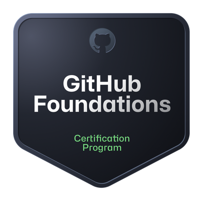

# About Me

I'm a passionate DevOps Engineer interested in DevEx and CICD.  
I believe that a great Developer Experience is essential for creating quality code and running efficient organizations.

- 🎓 BSc in Computer Engineering and an MSc in Electrical Engineering
- 👀 I'm interested in DevOps culture, Dev Experience, Automation, and Infrastructure as Code (IaC).
- 🎯 Hobbies including coding, Brazilian jiu-jitsu, DYI, playing video games, dancing, among others 😅
- 🇧🇷 Made in Brazil - Based in Sweden 🇸🇪
- 🎤 [My Sessionize Profile](https://sessionize.com/renan-alm) 
- 📫 How to reach me: [renan-alm@github.com](mailto:renan-alm@github.com) 

# GitHub Certifications

  
  
  

  
  

 
 
 
# Some of my toolbox

  

<!-- 
## My Skills
- **Languages**: Python, Java, Go, Bash, SQL
- **Frameworks**: Flask, Spring Boot
- **Tools**: GitHub Actions, Jenkins, Ansible, Terraform, Azure, GCP, Linux, Red Hat, Debian, Maven, Kubernetes, Docker, Git, GitHub, GitLab, Bitbucket, VSCode, Vim, IntelliJ IDEA, PyCharm, Obsidian, Elasticsearch, Grafana, Prometheus, MATLAB, Postman, Arduino
-->

 
 
 
# GitHub Stats

<!-- 
## Top Languages

-->
